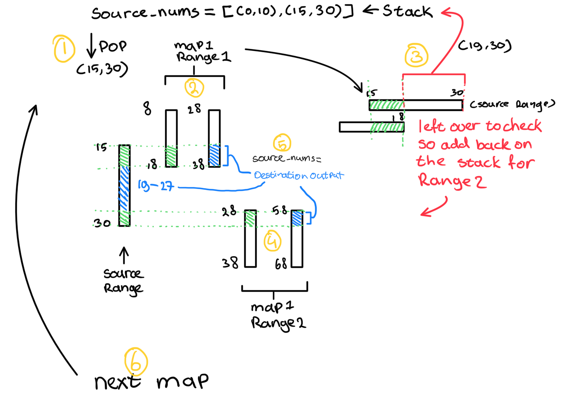

## Part 1

**Short explanation of the context**
Part one was more reading than coding. Basically you start with initial source numbers which are the seed numbers. then these source numbers are going though various sequential mapping layers, where the last one is the location mapping layer. A map has the following structure:

```
some map:
50 98 2 <- start destination, start source, length of ranges
52 50 48 <- eg. destination range: 52-99, source range 50-98
```

For each source number we check in what row it belongs to. Source number 99 falls into the first row (98, 99). We then take the destination number from the same row (50, 52), at the same place!. See the example below:

<table>
  <tr>
    <th>Source range</th>
    <td>Destination range</td>
  </tr>
  <tr>
    <th>50</th>
    <td><u>99</u></td>
  </tr>
  <tr>
    <th>52</th>
    <td><u>52</u></td>
  </tr>
</table>

Source numbers that do not fall into any range are mapped to themselves!

We now have new numbers that we can map again in de next mapping layer etc..

From the last "location" mapping layer we take the lowest number.

**Approach part 1:**
I store each map into a list of lists:

```python
[
  [
    [1,2,3], [4,5,6] # Ranges map 1
  ],
  [
    [7,8,9], [10,11,12] # Ranges map 2 etc
  ]
]
```

For each map I perform the mapping for each source number as follows:

```python
for num_i, num in enumerate(source_numbers):
    for map_range in a_map:
      d, s, l = row # destination range start, source range start, length
      if s <= num <= s + (l-1):
        offset = num - s
        source_destination = d + offset
        destination_numbers[num_i] = source_destination
        break
```

after each map I update the source numbers with the destination numbers and continue with the next map.

```python
source_numbers = destination_numbers
```

# Part 2 (Oh no my CPU is melting!)

The seed numbers we received was a list of number [5, 3, 10, 3], however these numbers are ranges too. Meaning each pair of two number is the start and the length of the range. so [(5, 3), (10, 3)] -> [5, 6, 7, 10, 11, 12]. My first thought was to just add all numbers to the source numbers, but since the numbers in the input are really high, this will not work.

**Approach part 2:**
I decided to work with the ranges instead of individual numbers. So [5, 3, 10, 3] -> [(5, 7), (10, 12)]. To map these ranges I check the parts that overlap with the mapping ranges, save the overlapping parts as new destination ranges. To handle partially overlapping ranges I store the left over parts as a separate range to the current source numbers, to check if other ranges of the same map overlap with the left over parts. In the end we also store the ranges if they have no match with the mapping ranges.

as we did in part 1 we set the source number to the destination number and continue with the next map.

The code for this is self explanatory, but to clear up the process I made a drawing of how I map the source numbers to the first map:


