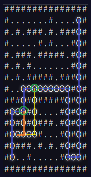

## Part 1

> The goal is to find node E, from node S in a 2D maze. Each step costs 1 and each 90 degree turn costs 1000. The goal is to find the path with the least cost.

```
###############
#.......#....E#
#.#.###.#.###.#
#.....#.#...#.#
#.###.#####.#.#
#.#.#.......#.#
#.#.#####.###.#
#...........#.#
###.#.#####.#.#
#...#.....#.#.#
#.#.#.###.#.#.#
#.....#...#.#.#
#.###.#.#.#.#.#
#S..#.....#...#
###############
```

### Approach

To solve this I use a similar approach to the Dijkstra algorithm. It is basically a breadth-first search algorithm with weights. Normally with BFS you pop the first item from the queue. With my approach, I use the heapq module to pop the item with the least cost. Each item in the queue has the position, the cost (used to sort the queue) and the previous direction.

Each step I check if the next direction is different then the previous direction. If it is, I add 1000 to the cost.

Finally when I reach the end node, I return the cost.

## Part 2

> The goal is to find how many tiles are part of at least one of the best paths through the maze. So basically all the paths reaching the end with the best cost.

### Approach

So we need to find all the paths with the same 'best' score, meaning each path that has the same amount of steps and turns.

My inital idea was to discover all possible paths to E and storing all the paths in a list, sorting it by cost, and find how many unique tiles are in the best paths. The problem I first encountered was that the visited set prevents alternative 'best' paths to be discovered. Each path needs to follow their own visited tiles to prevent loops. This was fine, and worked well with small mazes. But the input is too large for this.

**New Approach**
Instead of discovering all possible paths from S to E. I noticed that alternative best paths form when they branch of the main best path and joining back on the best path, while travelling the same amount of steps and turns. This means that if there is a collision with the best path on a certain tile, with the same amount of cost, facing the same direction, it is part of the best path. I still prune previous visited tiles like before. But now before a collision is pruned, I check if the collision has the same cost and direction. Then I will add the nodes visited on the alternative branch to the main best path nodes. Then in the end I have a collection of all the best paths tiles, while maintaining almost the same performance as part 1.


